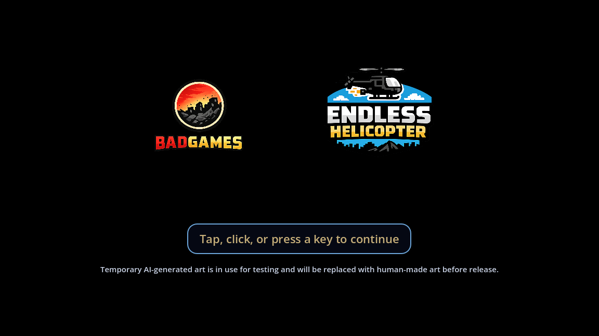
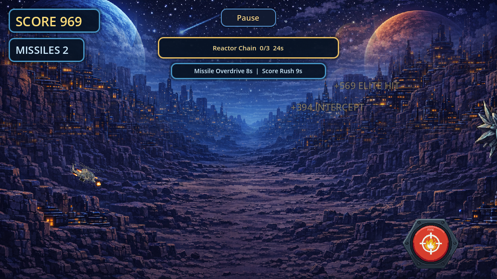
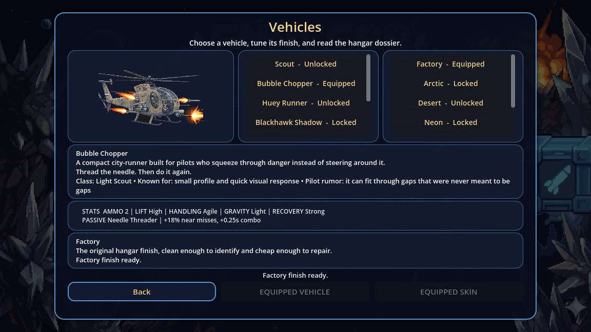
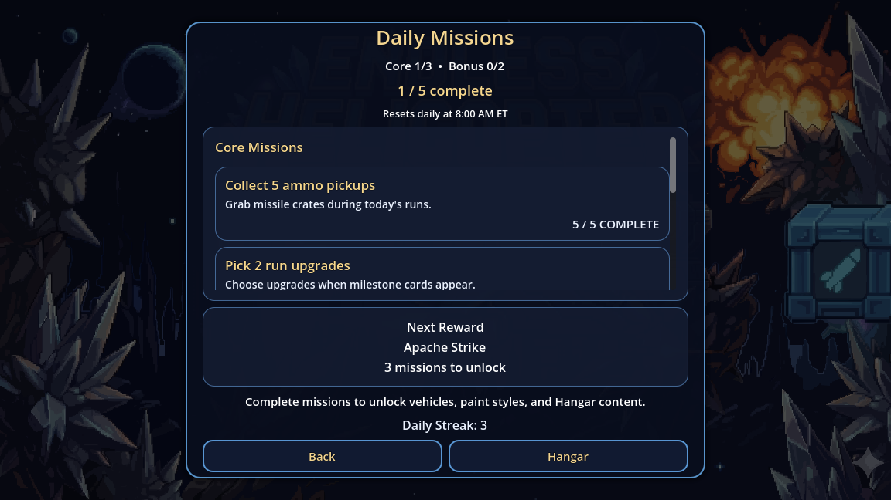

# Endless Helicopter Reborn

`Endless Helicopter Reborn` is a Godot 4.6 mobile arcade game. You pilot a vehicle through an endless obstacle field, collect ammo and temporary powerups, pick run-only upgrades, complete short objectives, lean into vehicle passives, survive stronger enemy pressure, complete daily missions, unlock vehicles and per-vehicle finishes, compete on a shared online leaderboard, and tune controls, haptics, and frame rate from the settings menu.

## Download Latest APK

- Latest versioned release: [GitHub Releases Latest](https://github.com/jessejamesblack/endless-helicopter-reborn/releases/latest)
- Rolling Android alias: [Endless-Helicopter-Reborn Latest APK](https://github.com/jessejamesblack/endless-helicopter-reborn/releases/tag/android-latest)
- Direct stable APK links usually appear on those release pages as `Endless-Helicopter-Reborn-release.apk` or `Endless-Helicopter-Reborn-debug.apk`, depending on the build track.

For normal device testing, prefer the latest versioned release. Same-device update and restore testing is only meaningful when the APKs are signed with the same stable key track.

## Gameplay Preview

| Title | Run |
| --- | --- |
|  |  |

| Hangar | Missions |
| --- | --- |
|  |  |

## Controls

| Input | Action |
| --- | --- |
| Tap, click, or Space | Flap / gain lift |
| Fire button | Launch a missile when ammo is available |
| Pause button | Pause the run, open missions, settings, or quit |
| Settings | Change fire-button side, mirrored HUD layout, haptics, volume, and frame-rate cap |

## At A Glance

- Current roadmap: [docs/ROADMAP.md](docs/ROADMAP.md)
- Architecture notes: [docs/ARCHITECTURE.md](docs/ARCHITECTURE.md)
- Development and validation: [docs/DEVELOPMENT.md](docs/DEVELOPMENT.md)
- Android continuity runbook: [docs/ANDROID_CONTINUITY_CUTOVER.md](docs/ANDROID_CONTINUITY_CUTOVER.md)

## Features

- Endless survival-style arcade gameplay
- Mobile-friendly tap/click/space controls
- Missiles, ammo pickups, glowing-rock clears, and varied enemy roles
- Periodic 1-of-3 run upgrades, temporary powerups, and short objective events
- Distinct vehicle identities with passive run modifiers and Hangar stat readouts
- Enemy variants and stronger mid/late-run projectile pressure
- Boundary and pause-spam fairness protections
- Adjustable master/music/SFX volume, fire-button side, mirrored HUD layout, haptics intensity, and frame-rate cap
- Shared online leaderboard with player names
- Daily missions with a 3 core plus 2 bonus structure, pause-menu access, live in-run progress updates, vehicle unlocks, per-vehicle skin progression, and a hangar screen
- In-app beat-your-score notifications
- Android push notifications for score-beaten and daily-mission events
- Hybrid parallax background biomes for long runs with continuity through late-run transitions
- Original retro sci-fi menu and gameplay music
- Automated Android APK builds with GitHub Actions

## Current Gameplay Loop

Runs now combine execution, choices, pickups, objectives, and progression:

- Upgrade choices appear at milestone times around 35, 75, 120, and 170 seconds, capped at four picks per run.
- Powerups include Shield Bubble, Score Rush, Missile Overdrive, Ammo Magnet, EMP Burst, and Afterburner Burst.
- Objectives currently include rescue pickups and reactor chains, with score plus powerup or upgrade-choice rewards.
- Vehicles use canonical names such as Scout, Bubble Chopper, Huey Runner, Blackhawk Shadow, Apache Strike, Chinook Lift, Crazy Taxi, and Pottercar, each with a clearer passive identity.
- The Hangar shows selected-vehicle stats for ammo capacity, lift, handling, gravity, recovery, and passive perks.
- Daily mission progress updates live for in-run pickup/effect events such as ammo pickups, powerup collection/use, EMP activations, and shield absorbs, so the pause-menu mission view reflects the current run.
- Daily mission cloud sync is local-first and monotonic: startup restore preserves local mission progress when the device is ahead, queued local sync payloads merge upward, and the Supabase sync function merges per-mission progress instead of overwriting it with stale rows.
- Live daily mission completions keep an in-run progress floor and block reentrant stale disk refreshes while they are being applied, so profile/UI refreshes or cloud restores cannot make the end screen say complete while the mission list and sync payload fall back to older progress.

## Project Layout

```text
res://
  assets/
    art/
    audio/
    icons/
  backend/
  docs/
  scenes/
    effects/
    enemies/
    game/
    pickups/
    player/
    projectiles/
    ui/
  systems/
  tools/
```

## Opening The Project

1. Install Godot `4.6.x`.
2. Open the repository root in Godot.
3. The boot scene is [scenes/ui/title_screen/title_screen.tscn](scenes/ui/title_screen/title_screen.tscn), which continues into [scenes/ui/start_screen/start_screen.tscn](scenes/ui/start_screen/start_screen.tscn).

## Settings And Pause

- `Settings` is available from the start screen before a run.
- During a run, `Pause` opens a menu with resume, missions, settings, and quit-to-menu actions.
- Pause toggles are debounced to keep pause usable without allowing slow-motion abuse.
- Settings persist in `user://` and apply immediately.
- `Master Volume` controls the full mix.
- `Music Volume` controls the menu and gameplay music layer.
- `SFX Volume` controls effects only, such as helicopter, missiles, reloads, and explosions.

## Collaboration Flow

This repository now uses branches and pull requests for changes to `main`.

1. Create a branch from `main`.
2. Push your branch.
3. Open a pull request back into `main`.
4. Let CI validate the branch before merging.

See [CONTRIBUTING.md](CONTRIBUTING.md) for the working agreement.

This repo also includes a local `.githooks/pre-push` guard to help block accidental direct pushes to `main`.

## Local Validation

On Windows PowerShell:

```powershell
powershell -ExecutionPolicy Bypass -File .\tools\validate_godot.ps1 -GodotBin "C:\Path\To\Godot_v4.6.2-stable_win64_console.exe"
```

The full validator includes script parsing plus focused checks for depth retention, enemy pressure, spawn responsiveness, daily mission expansion, pause-menu missions, UI naming, score/combo feedback, release notes, and Android continuity-adjacent systems.

README media can be refreshed from the current scenes with:

```powershell
Godot_v4.6.2-stable_win64_console.exe --path . --script res://tools/capture_readme_media.gd
```

## Shared Leaderboard

The game can use Supabase for a shared leaderboard.

- Setup guide: [docs/ONLINE_LEADERBOARD_SETUP.md](docs/ONLINE_LEADERBOARD_SETUP.md)
- Push setup: [docs/PUSH_NOTIFICATIONS_SETUP.md](docs/PUSH_NOTIFICATIONS_SETUP.md)
- Daily mission push setup: [docs/DAILY_MISSIONS_PUSH_SETUP.md](docs/DAILY_MISSIONS_PUSH_SETUP.md)
- SQL bootstrap: [backend/supabase_leaderboard_setup.sql](backend/supabase_leaderboard_setup.sql)
- Player progress bootstrap: [backend/supabase_player_progress_setup.sql](backend/supabase_player_progress_setup.sql)
- Runtime service: [systems/online_leaderboard.gd](systems/online_leaderboard.gd)
- Push runtime: [systems/push_notifications.gd](systems/push_notifications.gd)

Current leaderboard/profile behavior:

- Android installs derive a reinstall-stable app `player_id` from the signed app package plus an Android-backed source identity.
- The raw Android source value stays internal; the app hashes it into its own stable `player_id` and `device_id` instead of exposing the system identifier directly.
- Returning players on the same phone should restore automatically after reinstall once their profile has been migrated onto that canonical app-owned id.
- Manual support restore by old `player_id` is still available in Settings, and current builds try to permanently migrate that old profile onto the phone's canonical Android-backed app id so future reinstalls on that device restore automatically.
- A public name is only required for leaderboard submission. Cloud profile restore and progression sync can exist before the player picks a public leaderboard name.
- Android exports now leave user data backup enabled and request data retention on uninstall, so local profile/config files still have a platform backup safety net.
- Same-device continuity now depends on one permanent signing key track. The app exposes the signing mode and signing-certificate preview in Debug so reinstall testing can confirm the expected key is in use.
- After the stable release-key cutover release has shipped and the fresh-start wipe has been executed, official Android builds are expected to restore automatically on the same device after uninstall/reinstall. See [docs/ANDROID_CONTINUITY_CUTOVER.md](docs/ANDROID_CONTINUITY_CUTOVER.md) for the procedural cutover runbook and support expectations.

## Android Push Notifications

Android push notifications use:

- Firebase Cloud Messaging for delivery
- a custom Godot Android plugin under [android/plugins/fcm_push_bridge](android/plugins/fcm_push_bridge)
- a Supabase Edge Function under [backend/supabase/functions/send-score-beaten-push](backend/supabase/functions/send-score-beaten-push)

This works with sideloaded APKs. You do not need Play Store publishing to receive FCM notifications on supported Android devices.

Current Android builds also include a compatibility bridge so push registration can still work when the plugin singleton loads but Godot does not expose every bridge method reliably through the usual plugin path. If the in-game diagnostics say `Compat bridge available: yes`, you are on the current push-capable Android bridge.

## Android APK Installation

### From a local build

1. Export the Android preset with `tools/export_android.ps1`.
2. Use the freshly exported APK from `build/android/`.
3. Copy that APK to your Android device.
4. Open the APK on the device.
5. If prompted, allow installs from unknown apps for the app you used to open the file.
6. Finish installation.

Avoid installing older APKs that happen to be sitting elsewhere in the repo, such as stale root-level exports. Those can contain an outdated Android push bridge even when the current source and AARs are correct.

Continuity-safe local exports should pass an explicit stable signing mode. Use `release_stable` for official continuity validation and keep `debug_stable` for controlled test-only builds. For example:

```powershell
powershell -ExecutionPolicy Bypass -File .\tools\export_android.ps1 -GodotBin "C:\Path\To\Godot_v4.6.2-stable_win64_console.exe" -SigningMode release_stable
```

After installing, open the in-game push diagnostics and confirm at least:

- `Plugin loaded: yes`
- `Compat bridge available: yes`
- `Bridge diagnostics available: yes`
- `Firebase ready: yes`
- `Signing: Stable release key` or `Signing: Stable debug key`

### From GitHub Releases

Each successful release build from `main` creates or updates:

- a versioned GitHub release such as `v1.6.1-build.155`
- a rolling prerelease alias named `android-latest`

1. Open the repository on GitHub.
2. Go to `Releases`.
3. Open either the latest versioned release or `Endless-Helicopter-Reborn Latest APK`.
4. Download `Endless-Helicopter-Reborn-debug.apk` or `Endless-Helicopter-Reborn-release.apk`.
5. Copy the APK to your Android device and install it.

### From GitHub Actions artifacts

If you want the raw workflow output directly, every push also uploads an artifact.

1. Open the repository on GitHub.
2. Go to `Actions`.
3. Open the latest `Android APK` workflow run.
4. Download the `Endless-Helicopter-Reborn-*` artifact.
5. Copy the APK to your Android device and install it.

## GitHub Actions APK Builds

This repository includes `.github/workflows/android-apk.yml`.

- Every candidate release should increment `export_presets.cfg` `version/code` and `version/name` before building or publishing.
- On pull requests to `main`, it validates the project and exports an Android APK artifact.
- On pushes to `main`, it validates the project, exports an Android APK, publishes a versioned GitHub release, and refreshes the rolling `android-latest` prerelease alias.
- Manual workflow runs only publish a release when they are run from `main`; branch and PR builds stay artifact-only.
- The workflow also builds the Android FCM plugin AAR before the APK export.
- The APK is uploaded as a workflow artifact.
- The workflow also updates a rolling GitHub prerelease alias named `Endless-Helicopter-Reborn Latest APK`.
- Pull request APK filenames use `Endless-Helicopter-Reborn-debug.apk` unless the canonical release keystore is configured.
- Pushes to `main` must publish `Endless-Helicopter-Reborn-release.apk` from the canonical stable release keystore for any user-facing rollout. A continuity-safe debug-signed APK is only for controlled testing when the stable debug key is intentionally used on non-public builds.
- This is better than committing generated APKs into the repository on every change.

### Stable signed builds

If you want Android installs to upgrade cleanly between CI builds, add these GitHub repository secrets:

- `ANDROID_KEYSTORE_BASE64`
- `ANDROID_KEYSTORE_PASSWORD`
- `ANDROID_KEY_ALIAS`

If these secrets are not present, the Android workflow now fails instead of generating a temporary-key artifact. That prevents installable CI builds from silently changing the Android-backed `player_id` across reinstalls.

The canonical public track is the permanent stable release key. The same-device automatic restore promise only applies after the planned cutover release has shipped and the wipe has been executed on live data. See [docs/ANDROID_CONTINUITY_CUTOVER.md](docs/ANDROID_CONTINUITY_CUTOVER.md).

## AI Collaboration

This repo intentionally follows a lightweight harness-engineering approach:

- short `AGENTS.md` as a map
- docs as the source of truth
- deterministic validation/export scripts
- CI as a feedback loop

See [docs/AI_COLLABORATION.md](docs/AI_COLLABORATION.md) for the project-specific rules.
